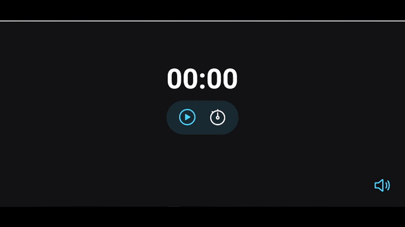

<h1 align="center">
  FocusTimer
</h1>

<h2 align="center" >Descrição do Projeto</h2>
<p align="center">
  FocusTimer versão 1.0 é uma aplicação que reúne as técnicas de Pomodoro e Lozanov, para te ajudar a ter ainda mais foco e concentração em suas tarefas do dia a dia.
</p>

<h1 align="center">
  
</h1>

## 🔎 Features

- [x] Iniciar o cronometro.
- [x] Pausar cronometro.
- [x] Parar cronometro.
- [x] Adicionar quantos minutos quero no cronometro.
- [x] Ao parar cronometro voltar para o tempo inserido anteriormente.
- [x] Ao clicar no icone de sem som, habilitar musica de fundo e trocar icone para com som
- [x] Ao clicar no icone de som, desabilitar musica de fundo e trocar icone para sem som

 


## :rocket: Tecnologias

Esse projeto foi desenvolvido com as seguintes tecnologias:

✔️ JavaScript

✔️ HTML

✔️ CSS

✔️ ES6 Modules

<h2>Pré-requisitos</h2>

Antes de começar, você vai precisar ter instalado em sua máquina as seguintes ferramentas:
[Git](https://git-scm.com) e [Node](https://nodejs.org/pt-br/).
Além disto é bom ter um editor para trabalhar com o código como [VSCode](https://code.visualstudio.com/).

## 🔗 Link da aplicação no ar: https://timer-focus.netlify.app/

# 👨‍💻 Rodando o Front End


```bash
# Clone este repositório
$ git clone https://github.com/gabriel-assana/FocusTimer
# Acesse a pasta do projeto no terminal/cmd
$ cd FocusTimer
# Abra um novo terminal e execute a aplicação em modo de desenvolvimento
$ yarn start
# O servidor do front-end inciará na porta:http://localhost:3000/ - acesse <http://localhost:3000/> 

